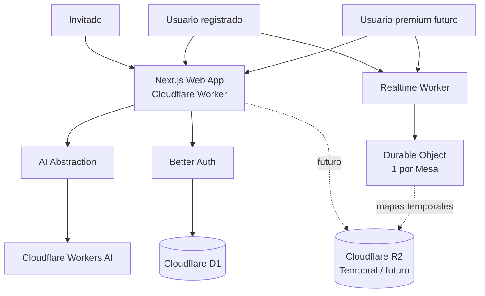
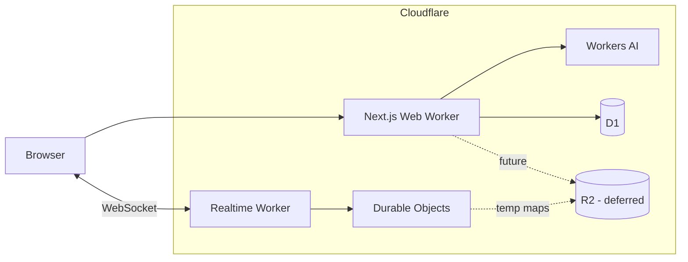

# Arquitectura técnica — Proyecto OpenCode RPG

**Fase:** 1 — Arquitectura técnica  
**Estado:** Aprobada para iniciar el diseño del stack y el bootstrap  
**Fecha:** 12 de agosto de 2026  
**Alcance:** MVP + puntos de extensión para futuras funciones premium

---

## 1. Resumen ejecutivo

El proyecto se construirá como una **aplicación web full-stack modular, edge-first y Cloudflare-first**.

La arquitectura inicial estará compuesta por:

```text
Browser
   │
   ▼
Cloudflare
   │
   ├── Web App
   │     Next.js + TypeScript
   │     desplegada en Cloudflare Workers mediante OpenNext
   │
   ├── D1
   │     usuarios, sesiones y datos persistentes mínimos
   │
   ├── Workers AI
   │     generación de texto e imágenes
   │
   ├── Realtime Worker
   │     servicio específico para "La Mesa"
   │        │
   │        └── Durable Object por mesa
   │              └── WebSockets + estado efímero
   │
   └── R2 [diferido]
         almacenamiento temporal de mapas de La Mesa
         y almacenamiento premium futuro
```

El producto se implementará como un **monolito modular en el dominio**, evitando microservicios de negocio. La única separación de despliegue prevista desde el MVP será el componente de tiempo real de **La Mesa**, porque tiene un modelo de ejecución distinto basado en WebSockets y Durable Objects.

---

# 2. Objetivos arquitectónicos

La arquitectura debe optimizar, por este orden:

1. **Coste inicial cero o free tier.**
2. **Simplicidad operativa.**
3. **Buena calidad del código.**
4. **Separación clara de responsabilidades.**
5. **Portabilidad entre proveedores de IA.**
6. **Seguridad frente a abuso de recursos gratuitos.**
7. **Capacidad para añadir persistencia premium sin reescribir los generadores.**
8. **Capacidad para evolucionar La Mesa sin convertir toda la aplicación en una VTT compleja.**
9. **Compatibilidad real con el runtime de Cloudflare Workers.**
10. **Facilidad para que agentes de OpenCode trabajen en módulos aislados.**

---

# 2.1 Invariante de alcance: tiempo real

Durante el MVP, **La Mesa es el único módulo multiusuario, colaborativo y sincronizado en tiempo real**.

Los módulos de aventuras, mapas generados, NPC, hojas de personaje y lanzador de dados independiente son herramientas individuales. No deben adquirir dependencias de WebSockets, Durable Objects, sesiones compartidas o sincronización entre usuarios.

El motor de dados puede reutilizarse dentro de La Mesa, pero únicamente las tiradas realizadas **dentro de una Mesa** se sincronizan con sus participantes.

---

# 3. Principios de arquitectura

## 3.1 Guest-first

Los generadores no dependerán de:

- autenticación;
- campañas;
- biblioteca;
- persistencia.

```text
Generator
   ↓
Input
   ↓
Generate
   ↓
Edit locally
   ↓
Download
```

Esto es una regla arquitectónica, no únicamente una decisión de UX.

---

## 3.2 Persistencia opcional

Un recurso debe poder existir sin estar almacenado.

```text
Resource
├── transient
└── persistent [future]
```

El dominio de generación no debe asumir que existe un `userId`, `campaignId` o registro en base de datos.

---

## 3.3 Provider-agnostic AI

Ninguna feature podrá importar directamente un SDK concreto de OpenAI, Cloudflare, Gemini, etc.

```text
Feature
   ↓
Application Use Case
   ↓
AI Port
   ↓
Provider Adapter
```

Workers AI será el primer adaptador, no la definición del dominio.

---

## 3.4 Server-authoritative realtime — exclusivamente para La Mesa

En La Mesa, el navegador propone acciones y el servidor decide el estado aceptado.

```text
Client action
    ↓
Realtime Worker / Durable Object
    ↓
Validation
    ↓
Canonical state
    ↓
Broadcast
```

No se confiará en que un cliente mantenga el estado correcto para el resto.

---

## 3.5 Edge-compatible by design

El código de servidor deberá ser compatible con Cloudflare `workerd`.

Se evitará incorporar dependencias que necesiten APIs exclusivas de Node.js salvo que estén expresamente soportadas por el runtime/compatibilidad de Cloudflare.

En desarrollo habrá dos niveles:

```text
next dev
→ desarrollo rápido

Cloudflare preview / wrangler dev
→ validación obligatoria contra workerd antes de integrar/desplegar
```

---

## 3.6 Modular monolith

El código de negocio se agrupará por **features/dominios**, no por capas técnicas globales.

```text
features/
├── adventures/
├── maps/
├── npcs/
├── character-sheets/
├── dice/
└── table/
```

Cada feature puede contener sus propios:

```text
components
domain
application
schemas
server
tests
```

Las infraestructuras compartidas vivirán aparte:

```text
lib/
├── ai/
├── auth/
├── db/
├── export/
├── security/
└── storage/
```

---

# 4. Arquitectura de contexto



---

# 5. Componentes principales

## 5.1 Web App

### Responsabilidades

- routing;
- layouts;
- renderizado;
- formularios;
- interfaz temática;
- Server Components;
- endpoints HTTP;
- Server Actions cuando resulten apropiadas;
- generación IA;
- exportación;
- autenticación;
- creación/unión a Mesas.

### Tecnología arquitectónica

```text
Next.js App Router
TypeScript strict
Cloudflare Workers
OpenNext adapter
```

Cloudflare recomienda Workers para aplicaciones Next.js full-stack. Pages se reservaría únicamente para exportaciones estáticas, por lo que no será nuestra plataforma principal.

---

# 6. Dominio de generación

Todos los generadores seguirán el mismo patrón conceptual.

```text
UI
 ↓
Input Schema
 ↓
Use Case
 ↓
Prompt Builder
 ↓
AI Port
 ↓
Provider
 ↓
Normalized Result
 ↓
Editor
 ↓
Exporter
```

Esto se aplicará a:

- aventuras;
- escenarios;
- NPC;
- mapas;
- futuras generaciones.

---

## 6.1 Ejemplo: aventura

```text
AdventureForm
    ↓
GenerateAdventureInput
    ↓
GenerateAdventure
    ↓
AdventurePromptBuilder
    ↓
TextGenerationPort
    ↓
CloudflareTextProvider
    ↓
AdventureDraft
```

`AdventureDraft` será un objeto del dominio de la aplicación, no texto arbitrario específico del proveedor.

Ejemplo conceptual:

```ts
interface AdventureDraft {
  title: string;
  premise: string;
  hook: string;
  locations: LocationDraft[];
  npcs: NpcSummary[];
  scenes: SceneDraft[];
  climax: string;
  endings: string[];
  gmNotes: string;
}
```

Esto permitirá:

- editar secciones;
- regenerar parcialmente en el futuro;
- exportar con distintos formatos;
- almacenar el recurso posteriormente.

---

# 7. Arquitectura de IA

## 7.1 Puertos

Se definirán al menos dos capacidades:

```text
TextGenerationPort
ImageGenerationPort
```

Ejemplo conceptual:

```ts
interface TextGenerationPort {
  generate<T>(request: TextGenerationRequest<T>): Promise<T>;
}

interface ImageGenerationPort {
  generate(request: ImageGenerationRequest): Promise<GeneratedImage>;
}
```

Las interfaces reales se concretarán en la fase de stack.

---

## 7.2 Adaptadores

Primera implementación:

```text
CloudflareWorkersAITextProvider
CloudflareWorkersAIImageProvider
```

Futuro:

```text
OpenAITextProvider
OpenAIImageProvider

GeminiTextProvider

LocalModelProvider
```

Una feature nunca debe hacer:

```text
import OpenAI from "openai"
```

o equivalente.

Solo los adaptadores de infraestructura pueden conocer el SDK/protocolo concreto.

---

## 7.3 Selección de proveedor

Inicialmente:

```text
AIProviderResolver
     ↓
Cloudflare Workers AI
```

En el futuro:

```text
AIProviderResolver
 ├── Cloudflare
 ├── OpenAI
 └── Gemini
```

La selección podrá depender de:

- tipo de generación;
- coste;
- modelo;
- disponibilidad;
- plan del usuario;
- calidad requerida.

---

## 7.4 Antiabuso

Los endpoints públicos de IA consumen el recurso más escaso del MVP: la cuota gratuita de inferencia.

Antes de llamar al modelo:

```text
Request
  ↓
Schema validation
  ↓
Bot protection
  ↓
Rate/quota check
  ↓
AI generation
```

Se prevé utilizar:

- Cloudflare Turnstile;
- limitación de frecuencia;
- tamaño máximo de prompts;
- límites de generación por cliente;
- timeout;
- cancelación;
- manejo explícito de cuota agotada.

No se confiará únicamente en validación del cliente.

---

# 8. Generación de mapas

## MVP

```text
Browser
   ↓ prompt + parameters
Web Worker
   ↓
ImageGenerationPort
   ↓
Workers AI
   ↓
image bytes
   ↓
Browser
   ↓
Preview / Download JPG
```

La imagen **no se almacenará permanentemente**.

Esto evita:

- base de datos innecesaria;
- almacenamiento;
- limpieza;
- costes prematuros.

---

## Futuro premium

```text
Generated Image
   ↓
StoragePort
   ↓
R2
   ↓
Resource metadata
   ↓
D1 / future database
```

El generador no cambiará: únicamente se añadirá el caso de uso `SaveGeneratedResource`.

---

# 9. Exportación

La exportación se modelará como otra capacidad independiente.

```text
ExportPort
├── Markdown
├── PDF
└── JPG
```

Siempre que sea razonable, la exportación se realizará en el navegador para:

- reducir consumo de Workers;
- evitar transferir de nuevo contenido privado;
- funcionar sin persistencia.

La biblioteca concreta para PDF se decidirá en la fase de stack después de comprobar compatibilidad y calidad.

---

# 10. Dados

El motor de dados es una librería de dominio pura.

```text
roll config / limited notation
   ↓
validation and evaluation
   ↓
DiceResult
```

`rollDice` evalúa una configuración estructurada y `rollNotation` compone el
parseo de la notación limitada con la misma evaluación. No se materializa un
tokenizer ni un AST en el MVP.

No dependerá de:

- React;
- Next.js;
- Cloudflare;
- base de datos.

---

## RNG

No se usará `Math.random()`.

Se utilizará una fuente basada en Web Crypto. El package aplica rejection
sampling antes de mapear enteros a caras para evitar modulo bias; `Math.random()`
no se utiliza. La fuente aleatoria es inyectable en tests.

### Dados independientes

El navegador puede ejecutar la tirada localmente.

### La Mesa

La tirada será **server-authoritative**:

```text
Player
  ↓ roll request
Durable Object
  ↓ secure RNG
DiceResult
  ↓ broadcast
All players
```

De esta forma todos ven exactamente el mismo resultado.

El package `@repo/dice-engine` limita las tiradas a 20 dados, admite entre 2 y
1000 caras, modificadores de -10000 a 10000 y notación limitada `NdX` con un
modificador opcional. No conoce autenticación, almacenamiento ni animación.
La animación de `/dice` representa un resultado ya resuelto y no interviene en
la aleatoriedad.

---

# 11. Autenticación

## Motor propuesto

```text
Better Auth
    ↓
Cloudflare D1
```

Motivos:

- open source;
- compatible con Next.js;
- soporte actual de Cloudflare D1;
- evita introducir una plataforma SaaS adicional;
- permite evolucionar métodos de autenticación;
- mantiene el MVP dentro de Cloudflare.

---

## Niveles

```text
Guest
Registered
Premium [future]
```

La identidad y el plan son conceptos diferentes.

```text
User
  └── Entitlements
```

No se llenará la aplicación de condicionales:

```ts
if (user.plan === "premium")
```

La autorización futura se basará en capacidades:

```text
canUseTable
canPersistResources
canCreateCampaigns
canPersistTable
canUseCampaignContext
```

Esto facilitará cambiar el modelo comercial más adelante.

---

# 12. D1

D1 será la base de datos persistente inicial.

## MVP

Guardará principalmente:

- usuarios;
- sesiones;
- datos de autenticación;
- perfil mínimo;
- metadatos necesarios para Mesas;
- posibles límites/entitlements cuando sean necesarios.

No almacenará inicialmente:

- aventuras de invitados;
- mapas generados;
- NPC generados;
- tiradas independientes.

---

## Futuro

Podrá incorporar:

```text
resources
campaigns
campaign_members
generations
saved_tables
```

Sin embargo, el acceso a datos se realizará mediante repositorios/ports para no acoplar el dominio a D1.

```text
CampaignRepository
ResourceRepository
UserRepository
```

Si una futura etapa premium justificara PostgreSQL u otra base de datos, el cambio quedará localizado principalmente en adaptadores de infraestructura y migración de datos.

---

# 13. La Mesa: arquitectura independiente

La Mesa es el componente de mayor complejidad del MVP.

Se desplegará como un **Worker específico de tiempo real**.

```text
Next.js Web Worker
        │
        │ crea/autoriza sesión
        ▼
Realtime Worker
        │
        ▼
Durable Object
1 instancia lógica por Table ID
        │
        ├── WebSocket A
        ├── WebSocket B
        ├── WebSocket C
        └── ...
```

No se considera un microservicio de negocio: es un adaptador de infraestructura especializado para tiempo real.

---

# 14. Identidad en La Mesa

Los usuarios deberán iniciar sesión.

Flujo previsto:

```text
User Login
   ↓
Better Auth
   ↓
Authenticated session
   ↓
Create / Join Table
   ↓
Short-lived realtime credential
   ↓
WebSocket connection
```

La credencial de tiempo real incluirá conceptualmente:

```text
userId
tableId
role
expiry
```

El Realtime Worker validará esta credencial antes de aceptar la conexión.

No se confiará en un `userId` enviado libremente por el navegador.

---

# 15. Estado de La Mesa

El Durable Object será la fuente de verdad.

Estado conceptual:

```ts
TableState {
  id
  hostId
  map
  grid
  tokens
  drawings
  participants
  revision
}
```

El modelo real se concretará más adelante.

---

## Estado gratuito

Será **efímero pero resistente a reconexiones**.

Este almacenamiento es **estado técnico temporal de sesión**, no persistencia de producto: no crea una Mesa guardada en la biblioteca del usuario ni permite recuperarla indefinidamente.

No significa "solo RAM".

El Durable Object puede usar su SQLite interno para mantener el estado operativo de la sesión y recuperarlo durante la vida útil de la Mesa.

Después de un periodo configurable de inactividad:

```text
Table expires
   ↓
temporary state deleted
   ↓
temporary map deleted
```

Una primera política razonable sería 24 horas, pero el TTL exacto se decidirá al implementar La Mesa.

Esto permite:

- reconectar;
- hibernación de WebSockets;
- recuperación tras reinicios;
- no ofrecer persistencia permanente.

---

# 16. Protocolo realtime

Los mensajes serán explícitos, tipados y versionados.

Ejemplo:

```text
table.joined
table.snapshot

token.created
token.updated
token.moved
token.deleted

drawing.created
drawing.deleted

dice.rolled

map.changed
```

Cada evento contendrá:

```text
type
version
tableId
actorId
payload
timestamp / sequence
```

Se validará el payload en el servidor.

---

## Reconexión

```text
Client reconnects
     ↓
auth
     ↓
join table
     ↓
snapshot
     ↓
continue receiving events
```

El cliente nunca dependerá exclusivamente del historial local para reconstruir La Mesa.

---

# 17. Mapas dentro de La Mesa

Aquí existe una necesidad diferente a "guardar un mapa en una cuenta".

Para que varios usuarios vean una imagen subida por el host, todos necesitan poder acceder al mismo recurso.

La solución prevista es:

```text
Host uploads map
     ↓
Temporary StoragePort
     ↓
R2 temporary object
     ↓
Table references temporary object
     ↓
Participants load map
```

El objeto se eliminará al expirar la Mesa o mediante una política de limpieza.

Esto **no equivale a biblioteca/persistencia premium**.

R2 se activará únicamente cuando lleguemos a La Mesa. No es necesario para las primeras features.

---

# 18. R2 futuro

R2 tendrá dos usos claramente separados.

## Temporary storage

```text
table-temp/
```

- mapas de sesiones;
- vida corta;
- limpieza automática.

## Persistent storage [premium]

```text
users/
campaigns/
resources/
```

- mapas guardados;
- PDFs;
- avatares;
- recursos de campaña.

El dominio accederá mediante:

```text
StoragePort
```

y no mediante llamadas R2 dispersas por la aplicación.

---

# 19. Seguridad

## 19.1 Inputs

Todo input externo se valida en servidor mediante esquemas.

Incluye:

- formularios;
- parámetros de IA;
- uploads;
- eventos WebSocket;
- IDs;
- filtros;
- contenido de exportación cuando aplique.

---

## 19.2 Uploads

Para mapas:

- límite de tamaño;
- tipos MIME permitidos;
- comprobación del contenido;
- nombres generados por servidor;
- nunca usar directamente el nombre del fichero como clave;
- impedir SVG inicialmente para reducir superficie XSS;
- JPG/PNG/WebP como candidatos de entrada;
- salida normalizada cuando resulte necesario.

---

## 19.3 IA

- prompt length limits;
- rate limiting;
- Turnstile;
- no exponer credenciales de proveedor;
- llamadas IA siempre desde servidor;
- no confiar en instrucciones devueltas por el modelo;
- resultados tratados como datos, no código;
- sanitización cuando se renderice contenido susceptible de HTML.

---

## 19.4 Auth

- cookies seguras;
- HTTPS;
- CSRF según mecanismo de autenticación;
- credenciales realtime de corta duración;
- permisos verificados en servidor;
- host no determinado por datos manipulables del cliente.

---

## 19.5 Secrets

Los secretos vivirán en bindings/secrets de Cloudflare.

Nunca:

```text
.env committed
secret in NEXT_PUBLIC_*
API key in browser
secret inside AGENTS.md
secret inside OpenCode skill
```

---

# 20. Diseño para el modelo premium

La arquitectura no implementará pagos todavía.

Sí implementará **seams** para añadir capacidades.

```text
EntitlementService

Guest
  ↓
basic generators

Registered
  ↓
table

Premium
  ↓
persistent library
  ↓
campaigns
  ↓
persistent table
  ↓
contextual AI
```

Los módulos premium dependerán de los generadores, nunca al revés.

Correcto:

```text
Campaigns → Resources → Generator outputs
```

Incorrecto:

```text
Generator → Campaign required
```

---

# 21. Campañas futuras

La campaña será un **agregado de organización**, no el núcleo obligatorio del producto.

```text
Campaign
├── Resources
├── NPCs
├── Characters
├── Adventures
├── Maps
├── Sessions
└── Context
```

La integración futura con IA será:

```text
Generation Input
  +
Selected Lore
  +
Campaign Context
     ↓
Context Builder
     ↓
AI Port
```

---

# 22. Lore y documentos aportados

No se implementará RAG en el MVP.

La arquitectura reservará:

```text
ContextProvider
├── GenericContext
├── LorePackContext
├── CampaignContext
└── UserDocumentContext
```

En el futuro, el `ContextBuilder` decidirá qué información enviar a la IA.

No se acoplarán las features a una base vectorial concreta.

Antes de ofrecer fuentes comerciales preinstaladas se revisarán específicamente licencias y derechos de uso.

---

# 23. Estrategia de estado frontend

Se priorizará:

1. estado local de React;
2. estado derivado de URL cuando corresponda;
3. estado de servidor mediante las capacidades de Next.js;
4. store global únicamente para módulos que lo justifiquen.

La Mesa probablemente necesitará un store cliente propio por su alto nivel de interacción.

No se introducirá Redux por defecto.

---

# 24. Comunicación HTTP

Se utilizará la herramienta más simple por caso.

## Server Components

Lecturas necesarias para renderizar páginas autenticadas.

## Server Actions

Mutaciones ligadas estrechamente a formularios cuando aporten simplicidad.

## Route Handlers

Preferidos para:

- generación con streaming;
- descarga/generación binaria;
- endpoints consumibles externamente;
- integración realtime;
- callbacks;
- APIs que requieran control explícito de HTTP.

La lógica de negocio nunca vivirá directamente dentro del handler.

---

# 25. Manejo de errores

Se definirán errores de aplicación independientes de proveedores.

Ejemplo conceptual:

```text
ValidationError
AuthenticationError
AuthorizationError
RateLimitError
GenerationUnavailableError
GenerationQuotaExceededError
RealtimeSessionExpiredError
UploadRejectedError
```

Un error concreto de Cloudflare no debe propagarse directamente hasta la UI.

```text
Provider error
   ↓
Adapter translates
   ↓
Application error
   ↓
UI-friendly response
```

---

# 26. Observabilidad

Durante beta se mantendrá simple.

## Necesario

- logs de servidor;
- errores de generación;
- errores de autenticación;
- conexiones/desconexiones de Mesa;
- errores WebSocket;
- consumo/cuota IA;
- latencia aproximada por generación.

## Evitar inicialmente

- almacenar prompts completos por defecto;
- almacenar contenido generado de invitados;
- herramientas SaaS de pago;
- telemetría excesiva.

Se deberá poder correlacionar una petición mediante un `requestId`.

---

# 27. Entornos

Como mínimo:

```text
local
preview
production
```

Durante la beta:

### Local

Máquina del desarrollador.

### Preview

Despliegues temporales o `workers.dev` para validar cambios.

### Production beta

URL estable para los beta testers.

Más adelante:

```text
staging
production
```

si el volumen de cambios lo justifica.

---

# 28. Estrategia de testing arquitectónica

## Domain tests

Sin navegador ni Cloudflare.

Especialmente:

- dados;
- parsers;
- reglas;
- transformaciones;
- prompt builders;
- normalización.

## Application tests

Casos de uso con adaptadores fake.

Ejemplo:

```text
GenerateAdventure
   ↓
FakeTextProvider
```

No deben consumir cuota IA.

## Integration tests

- D1;
- Better Auth;
- Workers AI adapter con mocks/fixtures;
- Durable Objects;
- storage.

## E2E

Playwright:

```text
Generate adventure
Generate NPC
Generate map
Login
Create table
Join from second browser
Move token
Roll dice
Verify synchronization
```

---

# 29. IA en tests

Por defecto:

```text
FakeAIProvider
```

Las pruebas automatizadas **no llamarán a Workers AI**, salvo tests de integración explícitos ejecutados manualmente o mediante una suite restringida.

Esto evita:

- coste/cuota;
- flakiness;
- resultados no deterministas;
- lentitud.

---

# 30. Estructura lógica preliminar

La estructura definitiva se cerrará en una fase posterior, pero la arquitectura requiere aproximadamente:

```text
src/
├── app/
│
├── features/
│   ├── adventures/
│   ├── maps/
│   ├── npcs/
│   ├── character-sheets/
│   ├── dice/
│   └── table/
│
├── components/
│   ├── ui/
│   └── shared/
│
├── lib/
│   ├── ai/
│   │   ├── ports/
│   │   └── providers/
│   ├── auth/
│   ├── db/
│   ├── export/
│   ├── security/
│   └── storage/
│
└── config/

workers/
└── realtime/
    ├── durable-objects/
    ├── protocol/
    └── tests/

docs/
├── product/
└── architecture/
    └── adr/
```

La presencia de `workers/realtime` no convierte el repositorio en una arquitectura de microservicios: es un componente especializado del mismo producto.

---

# 31. Despliegue



---

# 32. Arquitectura de coste inicial

## Necesario desde el inicio

| Componente         | Proveedor                  | Objetivo          |
| ------------------ | -------------------------- | ----------------- |
| Hosting full-stack | Cloudflare Workers Free    | Next.js           |
| IA                 | Workers AI free allocation | Texto e imagen    |
| DB                 | D1 Free                    | Auth + metadatos  |
| Auth library       | Better Auth                | Autenticación     |
| Realtime           | Durable Objects Free       | La Mesa           |
| Bot protection     | Turnstile Free             | Proteger IA/forms |

## Diferido

| Componente          | Momento                                     |
| ------------------- | ------------------------------------------- |
| R2                  | al implementar mapas compartidos en La Mesa |
| Vector DB / RAG     | fase Lore/Context                           |
| Servicio de email   | solo si el método de login lo necesita      |
| Pasarela de pago    | fase premium                                |
| Observabilidad SaaS | solo si la beta demuestra necesidad         |

---

# 33. Límites gratuitos que condicionan la beta

Según la documentación vigente en agosto de 2026:

### Workers

El plan gratuito tiene un límite de peticiones diario. La beta debe tratar un `429`/límite alcanzado como un estado esperado y mostrar un mensaje adecuado.

### Workers AI

Existe una asignación gratuita diaria. Los generadores deberán poder rechazar nuevas generaciones de manera limpia cuando se agote.

### D1

El free tier es suficiente para autenticación y una beta pequeña, pero se deberán utilizar índices y consultas acotadas.

### Durable Objects

El free tier soporta Durable Objects SQLite. La WebSocket Hibernation API será preferente para reducir consumo de duración.

### R2

Cuando se active, su free tier es ampliamente suficiente para una beta pequeña con mapas temporales, siempre que haya limpieza.

Estos límites no deben codificarse como constantes de negocio: serán configuración.

---

# 34. Decisiones explícitamente descartadas en esta fase

## Microservicios de negocio

No aportan valor en el MVP.

## Kubernetes / contenedores de producción

Innecesarios con Workers.

## Backend Node separado

Next.js + Workers cubre el backend inicial.

## Supabase

Es una alternativa válida, pero introduciría otra plataforma cuando Cloudflare D1 + Better Auth cubren las necesidades iniciales.

Se reconsiderará si una futura necesidad concreta de PostgreSQL lo justifica.

## Base vectorial

No existe todavía RAG.

## Redis

No existe un caso de uso que lo necesite.

## GraphQL

No existe un problema que justifique añadirlo.

## Persistencia de todo lo generado

Contradice el modelo guest-first y añade coste/complejidad.

---

# 35. Riesgos arquitectónicos

## R1 — Compatibilidad Next.js / Workers

Next.js se desarrolla habitualmente en Node, pero producción será `workerd`.

### Mitigación

- dependencias compatibles;
- preview Cloudflare obligatorio;
- tests de integración en runtime equivalente a producción.

---

## R2 — Cuota gratuita de IA

Una beta abierta puede consumir rápidamente la cuota.

### Mitigación

- Turnstile;
- rate limiting;
- límites de prompt;
- límites por usuario/IP;
- mensajes de cuota;
- métricas.

---

## R3 — La Mesa crece demasiado

Puede convertirse en un proyecto dentro del proyecto.

### Mitigación

MVP estricto:

```text
map
grid
tokens
lines/arrows/shapes
dice
realtime
```

Nada de iluminación, vídeo, audio o reglas automáticas inicialmente.

---

## R4 — D1 deja de encajar en una futura fase premium

Es posible que una evolución concreta beneficie más de PostgreSQL.

### Mitigación

- repositorios;
- dominio independiente de SQL;
- migraciones versionadas;
- no exponer objetos D1 fuera de infraestructura.

---

## R5 — Dependencia excesiva de Cloudflare

La infraestructura inicial será deliberadamente Cloudflare-first.

### Mitigación

Las piezas con mayor riesgo de lock-in tendrán ports:

```text
AI
Storage
Persistence repositories
```

El componente realtime sí estará más estrechamente ligado a Durable Objects, porque aporta una ventaja concreta y sustituirlo implicaría rediseñar la coordinación realtime.

---

# 36. Decisiones de arquitectura aprobadas

| ID      | Decisión                                                     |
| ------- | ------------------------------------------------------------ |
| ADR-001 | Arquitectura Cloudflare-first y free-first                   |
| ADR-002 | Next.js full-stack sobre Cloudflare Workers/OpenNext         |
| ADR-003 | Monolito modular orientado a features                        |
| ADR-004 | D1 + Better Auth como persistencia/auth inicial              |
| ADR-005 | IA mediante ports/adapters; Workers AI como primer proveedor |
| ADR-006 | La Mesa en Worker realtime separado + Durable Objects        |
| ADR-007 | R2 diferido; temporal para Mesa y persistente para premium   |

---

# 37. Próxima fase

La arquitectura ya permite abordar la **Fase 2 — Stack tecnológico definitivo**.

En esa fase deberán cerrarse versiones y librerías concretas para:

- Next.js;
- TypeScript;
- package manager;
- Tailwind;
- sistema de componentes;
- validación;
- formularios;
- ORM/query builder para D1;
- Better Auth;
- tests;
- WebSocket protocol validation;
- PDF;
- edición de canvas de La Mesa;
- estado cliente;
- lint/format;
- CI/CD.

No deberían generarse todavía funcionalidades de negocio hasta cerrar ese stack y las convenciones asociadas.

---

# 38. Referencias técnicas verificadas

- Cloudflare Next.js / Workers:
  https://developers.cloudflare.com/workers/framework-guides/web-apps/nextjs/

- OpenNext Cloudflare:
  https://opennext.js.org/cloudflare

- OpenNext known issues:
  https://opennext.js.org/cloudflare/known-issues

- Cloudflare D1:
  https://developers.cloudflare.com/d1/

- Cloudflare Durable Objects:
  https://developers.cloudflare.com/durable-objects/

- Durable Objects + WebSockets:
  https://developers.cloudflare.com/durable-objects/best-practices/websockets/

- Cloudflare Workers AI:
  https://developers.cloudflare.com/workers-ai/

- Cloudflare R2:
  https://developers.cloudflare.com/r2/

- Cloudflare Turnstile:
  https://developers.cloudflare.com/turnstile/

- Better Auth:
  https://www.better-auth.com/

- Better Auth + Next.js:
  https://www.better-auth.com/docs/integrations/next

Estas referencias deberán revisarse de nuevo al hacer el bootstrap, ya que son productos y APIs que evolucionan con frecuencia.
