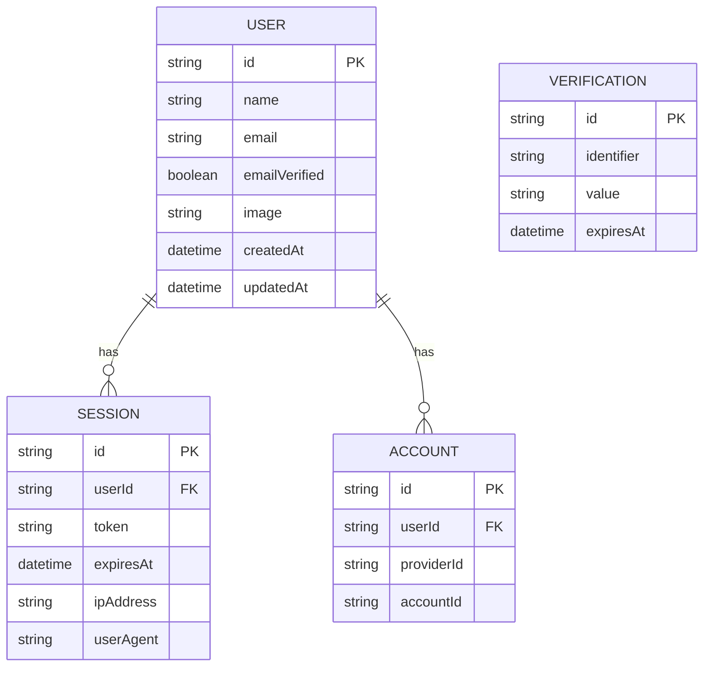
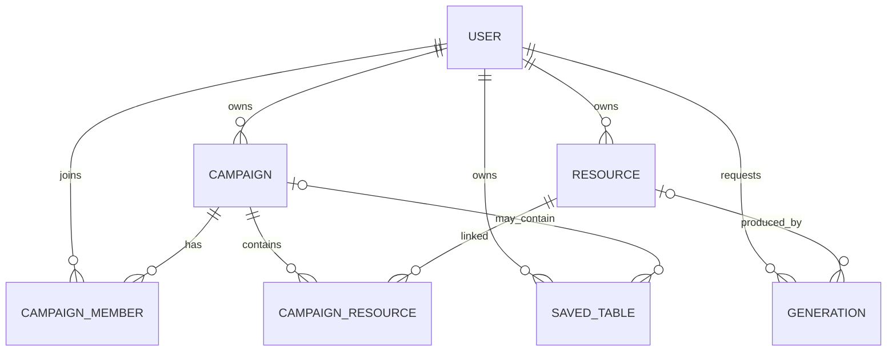
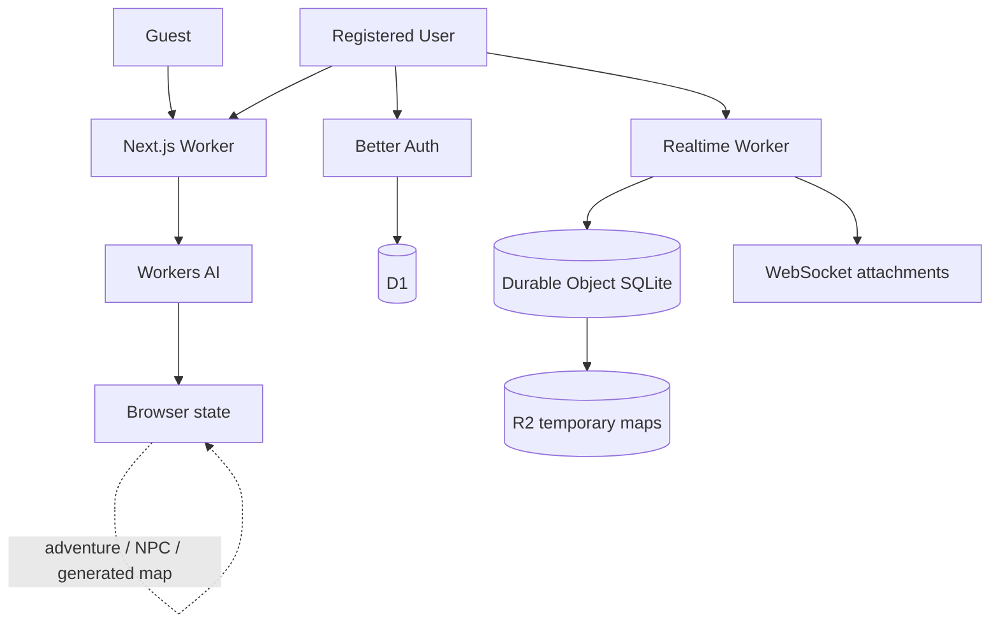

# Modelo de datos — Proyecto OpenCode RPG

**Fase:** 3 — Modelo de datos  
**Estado:** Aprobado para diseñar estructura de repositorio y bootstrap posterior  
**Versión:** 0.1  
**Fecha:** 12 de agosto de 2026

---

## 1. Objetivo

Definir qué datos existen, dónde viven y durante cuánto tiempo, respetando una regla fundamental del producto:

> **Usar primero; guardar y organizar después.**

El modelo distingue explícitamente tres capas:

```text
A. Persistencia MVP
   → identidad y autenticación

B. Estado temporal de La Mesa
   → colaboración realtime, con expiración

C. Persistencia premium futura
   → biblioteca, campañas, historial y Mesas guardadas
```

Estas capas **no deben mezclarse**.

---

# 2. Regla principal para OpenCode

## IMPORTANTE

Las entidades descritas como **FUTURAS** en este documento sirven para reservar una dirección arquitectónica.

**NO deben convertirse en tablas, migraciones, endpoints ni código durante el MVP salvo instrucción expresa.**

En particular, el bootstrap inicial **NO debe crear**:

```text
campaigns
resources
generations
saved_tables
subscriptions
entitlements
lore_packs
user_sources
```

El esquema persistente inicial debe ser deliberadamente pequeño.

---

# 3. Dónde vive cada dato

| Tipo de dato              |                           MVP |         Persistente | Tecnología                    |
| ------------------------- | ----------------------------: | ------------------: | ----------------------------- |
| Usuario                   |                            Sí |                  Sí | D1 / Better Auth              |
| Sesión de autenticación   |                            Sí | Sí hasta expiración | D1 / Better Auth              |
| Cuenta OAuth              |                            Sí |                  Sí | D1 / Better Auth              |
| Aventura generada         |                            Sí |                  No | Navegador                     |
| NPC generado              |                            Sí |                  No | Navegador                     |
| Hoja generada             |                            Sí |                  No | Navegador                     |
| Mapa generado             |                            Sí |                  No | Navegador                     |
| Tiradas standalone        |                            Sí |                  No | Navegador                     |
| Estado de La Mesa         |                            Sí |            Temporal | Durable Object                |
| Tokens de La Mesa         |                            Sí |            Temporal | Durable Object SQLite         |
| Dibujos de La Mesa        |                            Sí |            Temporal | Durable Object SQLite         |
| Tiradas dentro de La Mesa |                            Sí |        No historial | Evento WebSocket              |
| Participantes conectados  |                            Sí |       Solo conexión | WebSocket attachments         |
| Mapa subido a La Mesa     | Sí cuando se implemente Table |            Temporal | R2                            |
| Biblioteca personal       |                        Futuro |                  Sí | D1 + R2                       |
| Campañas                  |                        Futuro |                  Sí | D1                            |
| Historial de generación   |                        Futuro |                  Sí | D1                            |
| Mesa guardada             |                Futuro premium |                  Sí | D1 + Durable Object           |
| Fuentes del usuario       |                Futuro premium |                  Sí | D1 + R2 / vector store futuro |

---

# 4. Modelo persistente del MVP — D1

## 4.1 Decisión

Durante el MVP, D1 se utilizará **principalmente para Better Auth**.

No necesitamos una tabla `table_sessions` en D1 para que La Mesa funcione.

No necesitamos almacenar generaciones para que los generadores funcionen.

---

## 4.2 Schema de Better Auth

Better Auth mantiene un esquema núcleo formado por:

```text
user
session
account
verification
```

La versión exacta de columnas, índices y tipos se generará mediante Better Auth/Drizzle cuando fijemos la versión durante el bootstrap.

**No copiaremos manualmente el schema de Better Auth desde esta documentación.**

Motivo:

- Better Auth puede evolucionar;
- plugins pueden añadir tablas/campos;
- su CLI genera el schema correcto para la versión instalada.

---

## 4.3 Entornos D1 y migraciones

La estrategia de entornos será:

| Entorno | Base D1                    | Uso                        |
| ------- | -------------------------- | -------------------------- |
| Local   | D1 local mediante Wrangler | Desarrollo por defecto     |
| Dev     | `rpg-forge-dev` remota     | Integración y beta futuras |
| Prod    | `rpg-forge-prod` remota    | Producción futura          |

Los tres entornos compartirán la misma definición Drizzle y la misma secuencia ordenada de migraciones. La implementación actual expone únicamente:

```text
db:generate
db:migrate:local
```

Cuando existan los entornos remotos aprobados, se añadirán targets explícitos para:

```text
db:migrate:dev
db:migrate:prod
```

No existirá un comando `db:migrate` ambiguo. Local puede migrarse durante el desarrollo normal; Dev exige aprobación explícita antes de una operación remota; Prod nunca se migra automáticamente por OpenCode y requiere ejecución y autorización humanas explícitas. Las migraciones aplicadas a entornos remotos compartidos son inmutables: las correcciones se realizan mediante una nueva migración. Toda migración destructiva requiere revisión y aprobación explícitas.

Esta estrategia queda definida en ADR-049. La implementación actual crea únicamente `DB` local mediante Wrangler/Miniflare, un schema Drizzle para las tablas core de Better Auth y la migración local correspondiente. No existen todavía bases Dev/Prod remotas ni scripts para migrarlas.

---

## 4.4 Relaciones lógicas de autenticación



El diagrama es **conceptual**. El schema generado por Better Auth será la fuente técnica de verdad.

---

# 5. Qué NO añadiremos al usuario del MVP

No se añadirán todavía campos como:

```text
isPremium
plan
credits
campaignLimit
storageLimit
aiTokens
role = DJ/PJ
```

## Motivo

DJ/PJ describe el uso dentro de una partida, no una identidad global fija.

Un mismo usuario puede actuar como DJ en una partida y como jugador en otra.

Igualmente, premium es una capacidad comercial futura, no una característica intrínseca de la identidad.

---

# 6. Perfil

No se creará inicialmente una tabla `profile`.

Better Auth ya aporta los datos mínimos necesarios:

```text
id
name
email
image
```

Si posteriormente aparecen preferencias reales de producto:

```text
preferredLanguage
theme
defaultMapStyle
accessibilityPreferences
```

se evaluará una tabla específica de perfil/preferencias.

No se creará preventivamente.

---

# 7. IDs

## 7.1 IDs de Better Auth

Los gestiona Better Auth conforme a la versión/configuración instalada.

No se impondrá un formato propio sobre sus claves.

---

## 7.2 IDs de dominio

Para entidades propias se utilizarán identificadores:

- opacos;
- no secuenciales;
- generados en servidor cuando exista autoridad servidor;
- independientes del título/nombre del recurso.

Para el MVP, `crypto.randomUUID()` es suficiente y evita introducir una dependencia exclusivamente para generar IDs.

Ejemplos futuros:

```text
campaign.id
resource.id
drawing.id
token.id
```

Nunca se utilizará el nombre del recurso como clave primaria.

---

# 8. Fechas

## Auth

Se respetarán los tipos generados por Better Auth.

## Datos propios

Convención:

```text
UTC
INTEGER timestamp en milisegundos
```

a través del mapping de Drizzle adecuado.

Nombres:

```text
createdAt
updatedAt
expiresAt
lastActivityAt
```

No se almacenarán fechas locales ambiguas.

---

# 9. JSON

D1/SQLite se utilizará de forma relacional para:

- identidad;
- ownership;
- relaciones;
- estados consultables;
- fechas;
- claves externas.

JSON se reservará para datos estructurados cuyo esquema pueda variar.

Ejemplos futuros:

```text
AdventureDraft.content
NpcDraft.content
CharacterSheet.content
Generation.usage
```

## Regla

Todo JSON persistido tendrá:

```text
schemaVersion
```

y será validado con Zod al entrar y salir de la capa de persistencia.

---

# 10. La Mesa no vive en D1

## Decisión

Cada Mesa activa será coordinada por:

```text
1 Durable Object
=
1 Table Session
```

El ID de la Mesa identifica el Durable Object.

```text
Table ID
   ↓
Realtime Worker
   ↓
Durable Object instance
```

D1 no necesita conocer esa Mesa.

---

# 11. Por qué no existe `table_sessions` en D1 durante el MVP

Una tabla D1 implicaría conceptualmente:

```text
User
  ↓
Saved/listable table
```

pero el producto gratuito no ofrece Mesas guardadas.

La Mesa MVP es:

```text
authenticated
+
shareable
+
realtime
+
temporarily recoverable
≠
permanently saved
```

Por tanto:

- puede sobrevivir a una reconexión;
- puede sobrevivir a hibernación del Durable Object;
- puede mantenerse unas horas;
- no aparece en una biblioteca;
- no ofrece historial;
- expira automáticamente.

---

# 12. Identificador e invitación de La Mesa

Al crear una Mesa se generarán dos conceptos diferentes:

```text
tableId
inviteSecret
```

## tableId

Identificador opaco de la Mesa.

Ejemplo conceptual:

```text
550e8400-e29b-41d4-a716-446655440000
```

## inviteSecret

Secreto aleatorio de alta entropía que permite unirse mediante enlace/código.

El Durable Object almacenará únicamente:

```text
SHA-256(inviteSecret)
```

No el secreto en claro.

---

# 13. Crear o entrar en una Mesa

## Crear

```text
Authenticated user
      ↓
Web App
      ↓
Generate tableId + inviteSecret
      ↓
Create/initialize Durable Object
      ↓
Store hostUserId + invite hash
      ↓
Return join URL
```

## Entrar

```text
Authenticated user
      ↓
join URL
      ↓
Server validates invitation against Durable Object
      ↓
short-lived realtime credential
      ↓
WebSocket connection
```

La credencial realtime será temporal y estará firmada.

No se almacenará como sesión permanente en D1.

---

# 14. Identidad dentro de La Mesa

El Durable Object conocerá:

```text
userId
displayName
role
```

donde:

```text
role = host | participant
```

`role` es específico de esa Mesa.

No se añadirá al usuario global.

---

# 15. Participantes activos

Los participantes conectados no necesitan tabla SQL.

La información de cada WebSocket puede mantenerse mediante attachments compatibles con WebSocket Hibernation.

Modelo conceptual:

```ts
ConnectionContext {
  connectionId: string
  userId: string
  displayName: string
  role: "host" | "participant"
}
```

Al desconectar un socket, deja de ser participante activo.

No existe historial de presencia en el MVP.

---

# 16. Estado canónico de una Mesa

```ts
TableState {
  schemaVersion: number
  tableId: string
  hostUserId: string
  status: "active" | "closed"
  createdAt: number
  lastActivityAt: number
  expiresAt: number
  revision: number
  board: BoardState
  tokens: TokenState[]
  drawings: DrawingState[]
}
```

El objeto mostrado es conceptual.

El almacenamiento interno se dividirá para evitar reescribir todo el snapshot en cada cambio.

---

# 17. Coordenadas de La Mesa

Las posiciones se almacenarán en **coordenadas del mundo/tablero**, no en píxeles de pantalla.

```text
world coordinates
    ↓
camera / zoom / pan
    ↓
screen coordinates
```

Esto permite que:

- distintos tamaños de pantalla vean el mismo estado;
- zoom y pan sean locales;
- el movimiento de tokens sea consistente;
- la Mesa sea responsive.

---

# 18. Estado cliente que NO se comparte

No todo lo que ocurre en La Mesa pertenece al estado realtime.

Ejemplos de estado exclusivamente local:

```text
zoom
pan / viewport
herramienta seleccionada
token seleccionado
panel abierto
hover
cursor local
preview de arrastre
```

Estos datos pertenecen a Zustand/React en cada navegador.

No se persisten ni se retransmiten salvo necesidad futura.

---

# 19. Durable Object SQLite — modelo conceptual

Cada Durable Object dispone de su propio almacenamiento SQLite.

El MVP utilizará conceptualmente tres grupos de datos:

```text
table_meta
tokens
drawings
```

---

# 20. `table_meta`

Una única fila lógica por Durable Object.

Campos conceptuales:

| Campo              | Tipo      | Uso                        |
| ------------------ | --------- | -------------------------- |
| schema_version     | integer   | versión del estado         |
| host_user_id       | text      | usuario creador            |
| invite_secret_hash | text      | validar invitación         |
| status             | text      | active / closed            |
| created_at         | integer   | creación UTC               |
| last_activity_at   | integer   | última actividad relevante |
| expires_at         | integer   | expiración temporal        |
| revision           | integer   | revisión canónica          |
| board_state_json   | text/json | mapa + grid                |

---

# 21. `BoardState`

Ejemplo conceptual:

```ts
type BoardState = {
  schemaVersion: 1;
  map: {
    assetKey: string | null;
    mimeType: string | null;
    width: number | null;
    height: number | null;
  };
  grid: {
    enabled: boolean;
    cellSize: number;
    offsetX: number;
    offsetY: number;
    opacity: number;
  };
};
```

El mapa pertenece a un sistema de coordenadas propio.

La cuadrícula se renderiza sobre él.

---

# 22. `tokens`

Campos conceptuales:

| Campo              | Tipo    | Comentario               |
| ------------------ | ------- | ------------------------ |
| id                 | text PK | UUID                     |
| name               | text    | nombre visible           |
| color              | text    | color validado           |
| category           | text    | pc / npc / enemy / other |
| x                  | real    | coordenada mundo         |
| y                  | real    | coordenada mundo         |
| size               | real    | tamaño mundo             |
| rotation           | real    | inicialmente 0           |
| z_index            | integer | orden visual             |
| created_by_user_id | text    | referencia externa       |
| created_at         | integer | UTC                      |
| updated_at         | integer | UTC                      |
| revision           | integer | versión del objeto       |

## Importante

`created_by_user_id` no puede tener foreign key hacia D1 porque el almacenamiento del Durable Object es otra base de datos.

La autenticidad de ese ID procede de la credencial realtime validada.

---

# 23. `drawings`

Campos conceptuales:

| Campo              | Tipo      | Comentario                    |
| ------------------ | --------- | ----------------------------- |
| id                 | text PK   | UUID                          |
| kind               | text      | line / arrow / rect / ellipse |
| geometry_json      | text/json | coordenadas mundo             |
| stroke             | text      | color                         |
| stroke_width       | real      | ancho                         |
| z_index            | integer   | orden                         |
| created_by_user_id | text      | creador                       |
| created_at         | integer   | UTC                           |
| revision           | integer   | versión                       |

`geometry_json` será un discriminated union de Zod en función de `kind`.

Ejemplo:

```ts
LineGeometry;
ArrowGeometry;
RectangleGeometry;
EllipseGeometry;
```

---

# 24. Tokens: preview vs commit

Mover un token puede producir muchos eventos.

No escribiremos cada píxel recorrido en SQLite.

Modelo:

```text
drag start
   ↓
preview movement
   ↓
broadcast throttled
   ↓
NO persistence

drag end
   ↓
token.moved commit
   ↓
persist canonical position
   ↓
broadcast final state
```

Esto reduce escrituras sin perder el estado final.

---

# 25. Dibujo: preview vs commit

Igual que los tokens:

```text
pointer move
→ preview local / realtime temporal

drawing finished
→ validate
→ persist final geometry
→ broadcast committed drawing
```

No se almacenará un evento por cada movimiento del puntero.

---

# 26. Tiradas dentro de La Mesa

No habrá tabla `dice_rolls` en el MVP.

Flujo:

```text
client requests roll
      ↓
Durable Object
      ↓
secure RNG
      ↓
DiceResult
      ↓
broadcast
```

El resultado se muestra a los participantes actuales.

No forma parte del snapshot que se recupera después.

Por tanto:

> Tirada compartida ≠ historial de tiradas.

---

# 27. Revisionado de estado

La Mesa mantendrá un contador:

```text
revision
```

Cada mutación canónica confirmada incrementa la revisión.

Esto sirve para:

- detectar snapshots obsoletos;
- ordenar eventos;
- simplificar reconexión;
- facilitar debugging.

Los eventos preview no necesitan incrementar la revisión persistida.

---

# 28. Reconexión

```text
Client reconnects
      ↓
credential validation
      ↓
WebSocket accepted
      ↓
snapshot revision N
      ↓
client replaces shared state
      ↓
normal realtime events
```

No reconstruiremos la Mesa reproduciendo un historial completo de eventos.

El snapshot actual es la fuente de verdad.

---

# 29. Expiración de La Mesa

El TTL exacto será configurable.

Ejemplo de configuración:

```text
TABLE_TTL_HOURS
```

No se codificará el valor en el modelo de dominio.

## Actividad relevante

Puede extender `expiresAt`:

- conexión válida;
- cambio de mapa;
- commit de token;
- commit de dibujo;
- tirada compartida.

Los previews de alta frecuencia no deben actualizar la expiración constantemente.

---

# 30. Alarm de Durable Objects

El Durable Object programará un alarm para su expiración.

Al expirar:

```text
close / invalidate Table
      ↓
delete temporary R2 assets
      ↓
delete operational SQLite state
```

La URL antigua no debe recrear automáticamente una Mesa.

Crear una Mesa nueva exige una operación explícita autorizada desde la Web App.

---

# 31. Mapa temporal de La Mesa — R2

Cuando se implemente La Mesa, un mapa subido por el host tendrá que poder verlo el resto.

Se almacenará temporalmente en R2.

Convención conceptual:

```text
table-temp/
  <tableId>/
    <assetId>.<extension>
```

Ejemplo:

```text
table-temp/550e8400.../8102ca....jpg
```

---

# 32. R2 no será público

Los objetos de mapas de La Mesa no se expondrán mediante un bucket público sin control.

El acceso se realizará a través de una ruta/Worker autorizado.

Objetivos:

- evitar enumeración;
- aplicar límites;
- validar pertenencia a la Mesa;
- controlar MIME;
- facilitar eliminación.

---

# 33. Limpieza R2

Se aplicarán dos mecanismos:

## Primario

El Durable Object elimina sus assets al expirar.

## Defensa adicional

Una lifecycle rule de R2 eliminará automáticamente objetos antiguos bajo:

```text
table-temp/
```

Esto evita acumulación si el proceso primario falla.

El TTL de R2 será ligeramente mayor que el TTL normal de una Mesa para no borrar una sesión todavía válida.

---

# 34. Datos generados fuera de La Mesa

## Invitado

```text
AI result
   ↓
browser state
   ↓
edit
   ↓
download
```

No D1.

No R2 permanente.

No historial.

---

## Usuario registrado gratuito

Exactamente igual.

Estar autenticado **no convierte una generación en persistente**.

```text
logged in
≠
saved resource
```

Esta regla es especialmente importante.

---

# 35. Mapas generados

Durante el MVP:

```text
Workers AI
   ↓
response
   ↓
browser preview
   ↓
JPG download
```

No se crea:

```text
resources row
R2 permanent object
generation history
```

Si el usuario quiere utilizar inmediatamente ese mapa en La Mesa, la operación será explícita:

```text
generated map
    ↓
Use in Table
    ↓
temporary R2 upload
```

Sigue sin convertirse en recurso persistente.

---

# 36. Datos de rate limiting

No utilizaremos D1 como contador de peticiones públicas.

La protección de IA utilizará mecanismos específicos de Cloudflare/configuración de runtime.

Por tanto, no existirán inicialmente:

```text
ai_usage
guest_requests
ip_limits
generation_counters
```

en D1.

Si un futuro plan requiere cuotas mensuales persistentes por usuario, se diseñará entonces.

---

# 37. Modelo premium futuro

Todo este bloque es **DISEÑO FUTURO**, no schema MVP.



---

# 38. `campaigns` — FUTURO

Posible schema:

```text
id
owner_user_id
title
description
system_mode
lore_pack_id nullable
created_at
updated_at
archived_at nullable
```

`system_mode` inicialmente podría representar:

```text
generic
lore
custom
```

No se utilizarán nombres concretos de sistemas como columnas.

---

# 39. `campaign_members` — FUTURO

La colaboración persistente necesitará una relación explícita.

```text
campaign_id
user_id
role
created_at
```

Roles posibles:

```text
owner
gm
player
```

Aquí sí tiene sentido DJ/PJ porque el rol pertenece a **una campaña concreta**, no a la cuenta global.

Clave compuesta:

```text
(campaign_id, user_id)
```

---

# 40. `resources` — FUTURO

La biblioteca personal no tendrá necesariamente una tabla distinta para cada generador.

Modelo genérico:

```text
id
owner_user_id
kind
title
schema_version
content_json nullable
asset_key nullable
mime_type nullable
created_at
updated_at
```

`kind`:

```text
adventure
map
npc
character_sheet
location
other
```

## Texto estructurado

```text
content_json
```

## Binarios

```text
asset_key → R2
```

Ejemplo:

```text
Map
→ metadata in D1
→ image bytes in R2
```

No almacenaremos imágenes como BLOB en D1.

---

# 41. `campaign_resources` — FUTURO

Se utilizará una relación many-to-many.

```text
campaign_id
resource_id
created_at
```

Motivo:

Un recurso de biblioteca podría reutilizarse en más de una campaña sin duplicarlo.

Si posteriormente el producto decide restringir un recurso a una única campaña, este modelo sigue siendo válido.

---

# 42. `generations` — FUTURO

Solo se añadirá cuando exista una razón de producto para historial, auditoría de coste o regeneración.

Posible modelo:

```text
id
user_id
resource_id nullable
kind
provider
model
status
input_json nullable
usage_json nullable
created_at
```

## Privacidad

No se almacenarán prompts completos por defecto simplemente porque técnicamente sea posible.

La política deberá decidir:

- qué se guarda;
- para qué;
- cuánto tiempo;
- si el usuario puede eliminarlo.

---

# 43. `saved_tables` — FUTURO PREMIUM

Para hacer una Mesa persistente necesitaremos poder encontrarla desde la cuenta.

D1 almacenará **metadatos**, no el estado realtime completo.

Posible schema:

```text
id
owner_user_id
campaign_id nullable
durable_object_id
title
thumbnail_asset_key nullable
created_at
updated_at
last_opened_at
```

El estado operativo continuará en el Durable Object.

```text
D1
→ discover/list/auth metadata

Durable Object
→ canonical realtime state
```

---

# 44. Persistencia de una Mesa premium

Cambio conceptual:

```text
MVP Table
expiresAt → finite

Premium saved Table
persistent metadata in D1
+
DO state retained
```

Guardar una Mesa será una acción explícita.

No se convertirá automáticamente toda Mesa gratuita en permanente.

---

# 45. Lore — FUTURO

Modelo conceptual:

```text
LorePack
├── metadata
├── version
├── license information
└── sources

UserSource
├── owner
├── metadata
├── R2 document
└── processing status
```

Los embeddings/chunks no se modelan todavía.

La elección de Vectorize u otro vector store pertenece a una fase futura de RAG.

---

# 46. `lore_packs` — FUTURO

Posibles campos:

```text
id
slug
name
version
status
license_type
license_reference
created_at
updated_at
```

Debe existir información explícita de licencia/procedencia.

No se asumirá que disponer técnicamente de un PDF autoriza incorporarlo al producto.

---

# 47. `user_sources` — FUTURO PREMIUM

Posible metadata:

```text
id
owner_user_id
title
mime_type
asset_key
processing_status
created_at
updated_at
```

Los bytes del documento vivirían en R2.

La tabla no contendría el PDF como BLOB.

---

# 48. Premium y entitlements

No se añadirá:

```text
user.isPremium
```

El futuro modelo comercial se resolverá mediante un servicio:

```text
EntitlementService
```

capaz de responder:

```text
canPersistResources(user)
canCreateCampaigns(user)
canPersistTable(user)
canUseCampaignContext(user)
canUploadSources(user)
```

La fuente de esas capacidades podría ser posteriormente:

- una suscripción;
- un plan;
- una licencia beta;
- una promoción;
- administración manual.

No diseñaremos todavía tablas de pagos.

---

# 49. Foreign keys en D1 futuro

Las relaciones persistentes utilizarán foreign keys donde proceda.

Ejemplos:

```text
resources.owner_user_id
→ user.id

campaigns.owner_user_id
→ user.id

campaign_members.user_id
→ user.id

campaign_members.campaign_id
→ campaigns.id
```

Las acciones `ON DELETE` se decidirán conscientemente por relación.

No se aplicará `CASCADE` automáticamente a todo.

---

# 50. Índices futuros

Se crearán en función de consultas reales.

Primeros candidatos cuando existan esas tablas:

```text
resources(owner_user_id, updated_at)

campaigns(owner_user_id, updated_at)

campaign_members(user_id)

campaign_resources(campaign_id)

generations(user_id, created_at)

saved_tables(owner_user_id, updated_at)
```

No crearemos índices sobre columnas que nunca se consultan.

---

# 51. Ownership

Toda entidad persistente propiedad de un usuario tendrá ownership explícito.

```text
ownerUserId
```

No se inferirá únicamente a través de una campaña.

Ejemplo:

Un mapa puede existir en la biblioteca sin campaña.

```text
Resource
  owner = User
  campaigns = 0..N
```

Esto respeta el principio de herramientas independientes.

---

# 52. Datos transitorios vs persistentes

Esta distinción debe reflejarse también en el código.

Ejemplo conceptual:

```text
AdventureDraft
≠
SavedResource
```

```text
TableState
≠
SavedTableMetadata
```

```text
GeneratedImage
≠
StoredAsset
```

Que un dato tenga la misma apariencia para el usuario no significa que tenga la misma semántica de persistencia.

---

# 53. Modelos de dominio sugeridos

## Transitorios

```text
AdventureDraft
NpcDraft
CharacterSheetDraft
GeneratedMap
DiceResult
```

## Realtime temporal

```text
TableState
BoardState
TokenState
DrawingState
ConnectionContext
```

## Persistentes actuales

```text
AuthUser
AuthSession
AuthAccount
AuthVerification
```

## Persistentes futuros

```text
Campaign
Resource
CampaignMember
Generation
SavedTable
LorePack
UserSource
```

---

# 54. Regla de conversión

La conversión de transitorio a persistente debe ser explícita.

Futuro:

```text
AdventureDraft
      ↓
SaveResource
      ↓
Resource
```

No:

```text
GenerateAdventure
      ↓
automatic DB insert
```

Esto será importante para mantener gratuitas las herramientas básicas y controlar almacenamiento.

---

# 55. Borrado y privacidad

## MVP

Los datos generados individualmente no están en nuestro servidor de forma persistente, por lo que no requieren procesos de borrado de biblioteca.

Los datos de autenticación sí estarán sujetos a las capacidades de eliminación de cuenta de Better Auth y a las políticas que definamos antes de abrir producción.

## La Mesa

Los datos temporales expiran.

Los mapas temporales deben eliminarse.

## Futuro

La eliminación de una cuenta deberá contemplar:

```text
resources
campaign ownership
campaign memberships
saved tables
R2 objects
user sources
generation history
```

La política exacta se definirá antes de implementar premium.

---

# 56. No almacenar secretos

Nunca en D1/DO/R2:

```text
Cloudflare API tokens
OAuth client secrets
AI provider secrets
realtime signing secret
```

Se almacenarán mediante Cloudflare Secrets.

Los invite secrets de Mesa se almacenan solo como hash.

---

# 57. No almacenar contenido derivado innecesario

Evitar duplicar:

```text
HTML + Markdown + JSON + PDF
```

para el mismo recurso.

Modelo futuro recomendado:

```text
structured resource
     ↓
export on demand
     ├── Markdown
     └── PDF
```

Un PDF solo se almacena si existe una razón funcional para conservar ese archivo concreto.

---

# 58. Diagrama completo de almacenamiento MVP



---

# 59. Qué migraciones existirán al iniciar el proyecto

Cuando llegue la fase de bootstrap, la base D1 inicial deberá contener:

```text
Better Auth schema
```

y nada más salvo que una necesidad técnica concreta detectada durante implementación lo justifique.

**No se crearán tablas premium “para ir adelantando”.**

---

# 60. Qué schema pertenece al Worker realtime

El Durable Object sí necesitará su propio schema operacional cuando implementemos La Mesa:

```text
table_meta
tokens
drawings
```

Ese schema:

- no forma parte de D1;
- no se crea durante el bootstrap inicial si todavía no implementamos La Mesa;
- se versionará junto al Realtime Worker;
- tendrá su propia estrategia de migración.

---

# 61. Fuentes de verdad

| Concepto                             | Fuente de verdad                   |
| ------------------------------------ | ---------------------------------- |
| Usuario autenticado                  | Better Auth / D1                   |
| Resultado de generador sin guardar   | Navegador                          |
| Estado compartido de una Mesa        | Durable Object                     |
| Participantes actualmente conectados | WebSockets                         |
| Mapa temporal de Mesa                | R2                                 |
| Recurso guardado futuro              | D1 metadata + R2 si binario        |
| Campaña futura                       | D1                                 |
| Mesa premium futura                  | D1 metadata + Durable Object state |

---

# 62. Decisiones que quedan abiertas

No bloquean el siguiente paso:

### TTL exacto de una Mesa gratuita

Se decidirá al implementar realtime.

### Tamaño máximo de mapas

Se decidirá con pruebas de UX/coste.

### Retención exacta de R2 temporal

Se ajustará al TTL de Mesa.

### Estructura exacta de `AdventureDraft`

Se definirá al implementar el generador.

### Schema premium definitivo

Se revisará cuando realmente comience la capa premium.

### Sistema de pagos

Fuera de alcance.

---

# 63. ADR resultantes

| ADR     | Decisión                                            |
| ------- | --------------------------------------------------- |
| ADR-016 | Persistencia mínima del MVP: Better Auth en D1      |
| ADR-017 | Convenciones de IDs, timestamps y JSON              |
| ADR-018 | Estado temporal de La Mesa en Durable Object SQLite |
| ADR-019 | Modelo premium futuro sin migraciones prematuras    |

---

# 64. Próxima fase

Según el roadmap, la siguiente fase será:

**Fase 4 — Estructura del repositorio/directorios.**

A partir de este modelo podremos decidir con precisión dónde viven:

```text
auth schema
Drizzle
AI ports/providers
domain drafts
Table protocol
Durable Object
R2 adapters
future repositories
```

sin mezclar código de infraestructura con features.

---

# 65. Referencias técnicas verificadas

- Better Auth — Database / core schema:
  https://better-auth.com/docs/concepts/database

- Better Auth — Sessions:
  https://better-auth.com/docs/concepts/session-management

- Better Auth — Users & Accounts:
  https://better-auth.com/docs/concepts/users-accounts

- Cloudflare D1:
  https://developers.cloudflare.com/d1/

- D1 Foreign Keys:
  https://developers.cloudflare.com/d1/sql-api/foreign-keys/

- D1 Indexes:
  https://developers.cloudflare.com/d1/best-practices/use-indexes/

- Durable Objects SQLite Storage:
  https://developers.cloudflare.com/durable-objects/api/sqlite-storage-api/

- Durable Objects WebSocket Hibernation:
  https://developers.cloudflare.com/durable-objects/best-practices/websockets/

- R2 Object Lifecycles:
  https://developers.cloudflare.com/r2/buckets/object-lifecycles/

Estas referencias deberán revisarse al crear migraciones porque las APIs y herramientas pueden evolucionar.
